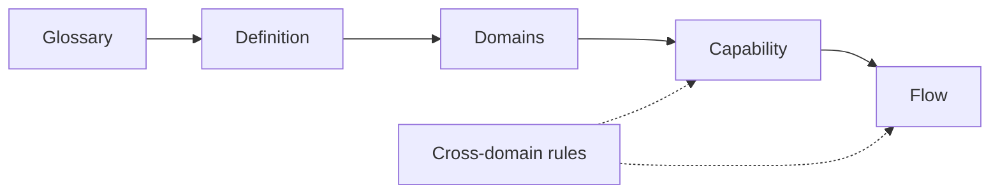

<!-- turystack:howto
     ─────────────────────────────────────────────────────────────────────
     HOW TO START {{PROJECT}}-spec
     ·
     This skill arrives empty on purpose: every section carries
     a `turystack:unfilled` marker, and a task that depends on an unfilled
     section stops and asks instead of guessing (SPC-1).
     ·
     Fill it through a conversation, not a documentation sprint. The order and
     the questions are `turystack-harness` › `04-spec-bootstrap.md`. Ask for it:
     ·
         "bootstrap da spec do {{PROJECT}}"
     ·
     Day one is two sections, in this order and nothing else:
     ·
         05-glossary.md      six to ten terms, with the Not column
         01-definition.md    actors, capabilities, out of scope
     ·
     Every decision leaves with an id (SPC-19). The board in `board/` is
     derived once the sections above answer, and every id ends up named by a
     task there and by the delivery report that proved it.
     ·
     When you have started — the glossary and the definition are written —
     remove these instructions; they describe an empty skill:
     ·
         npx @turystack/proof-mode-gates howto --strip .claude/skills/{{PROJECT}}-spec
     ·
     That strips every `turystack:howto` block from this skill, the board page
     included. The `turystack:unfilled` markers are not touched: those are
     decisions, and they go when someone makes them.
     ───────────────────────────────────────────────────────────────────── -->

# {{PROJECT}} — overview

> **Purpose.** This is {{PROJECT}}'s own skill, materialized from
> `@turystack/spec-template`. It holds what the project decided about **what it
> does**. Nothing about how the code is written lives here.

## Mental model



- **Glossary** comes first because every other section uses its words.
- **Definition** says what {{PROJECT}} is and what it can do.
- **Domains** say what exists, in which states, and how they legally change.
- **Capability** says what happens when someone does one thing, including when
  it goes wrong.
- **Flow** connects capabilities across domains, end to end.
- **Cross-domain rules** are the ones no single domain owns.

## Invariants

| ID | Law | Class | Gate |
|---|---|---|---|
| SPC-1 | An unfilled section stops the part of the task that depends on it. It is never improvised over, defaulted or deferred silently. | constitutional | `gate:spec-unfilled` |
| SPC-2 | One decision, one owning section. A rule restated in a second place is deleted from the second. | constitutional | `manual` |
| SPC-3 | This skill lives in the repository and changes in the same commit as the behavior it describes. | constitutional | `manual` |
| SPC-19 | Every decision here carries an id from the id space below. Ids are unique and permanent: a decision that is retired keeps its id and is marked retired, never reused — and every id a task implements appears in that task's delivery report, beside the test that proved it. | constitutional | `gate:rule-id-coverage` |

## The id space

Nobody asks for work in ids. A request arrives as a sentence, and the ids are
what happen next — they are the only thing that survives the trip from that
sentence to a test to a report. One space, one prefix per kind of decision:

| Prefix | Names | Written in |
|---|---|---|
| `AC-n` | an acceptance criterion of a capability | `01-definition.md` |
| `RULE-n` | a rule that crosses domains | `03-rules.md` |
| `EVN-n` | a published event, and the handlers that react to it | `04-flows.md` |
| `JOB-n` | something that runs on a clock | `04-flows.md` |
| `TC-n` | a test case a task will be proved by | `board/tasks.json`, via `07-board.md` |
| `UX-DR-n` | what a design obliges | `{{PROJECT}}-uiux` › `05-assets.md` |

Three properties, and `SPC-19` is worth nothing without all three:

```text
unique      one id, one decision — never two rules under one number
permanent   an id is never renumbered, never reused after a decision is
            dropped: a report from six months ago still means what it said
present     the id appears in the board task, in the test name, and in the
            delivery report — a decision proved nowhere reads exactly like a
            decision nobody made
```

The last one is what a machine checks. A report whose specs cite no id can list
twenty green tests and still not answer "was AC-2 implemented?", which is the
only question an audit ever asks.

## Why it is a skill and not a wiki

A spec in an external tool drifts silently: nothing breaks when it disagrees
with the code, so nothing tells anyone. Here it goes through the same review as
the change it describes — and the agent implementing the change reads it
without being told where to look.

`SPC-3` is the half people skip. A documentation follow-up ticket is a ticket
closed by time.

## Filling and updating

The shape halves come from the template and stay. The `{{PROJECT}}` halves are
yours. `06-filling.md` says how to fill one and when to create a new section.

When `turystack skills` runs again, this skill is **not** overwritten — it was
materialized once, under {{PROJECT}}'s name, and it belongs to {{PROJECT}} from
then on.

## Never do

- Improvising over an unfilled section because the answer seemed obvious
  (`SPC-1`).
- Restating a rule in a second section because it was convenient there
  (`SPC-2`).
- Updating this skill in a follow-up commit, after the behavior shipped
  (`SPC-3`).
- Writing an architectural law here — that is the constitution.
- Writing how a screen looks or is worded here — that is `{{PROJECT}}-uiux`.
- Renumbering an id, or reusing one whose decision was dropped (`SPC-19`).
